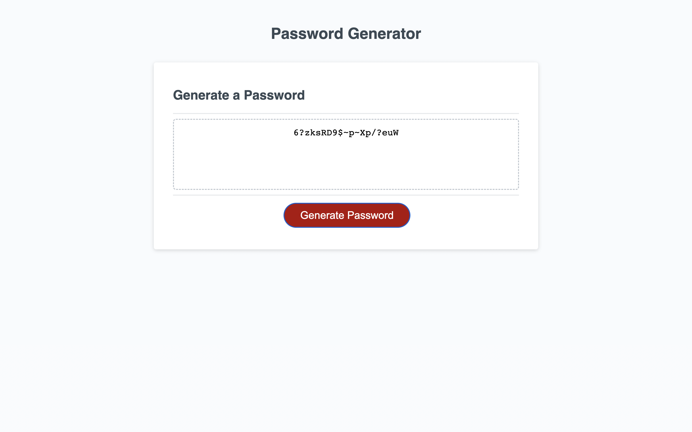

# password-generator

Module 5 Bootcamp Challenge

## Description

This application generates a random password from user input, according to user specifications, providing the minimium character requirements are met. These requirements are that the length must be between 10 and 64 characters and the user is then able to tailor their password by choosing character options for uppercase, lowercase, numbers etc.

## Usage

The application will not allow you to proceed to choosing the composition of a password if an invalid length is chosen. Please ensure you select a length of between 10 and 64 characters and then you are able to select whatever password composition given the options the application presents

## Screenshot

## URL

The URL of the deployed application is: https://sdjhen.github.io/password-generator/

## Credits

N/A

## License

NONE
